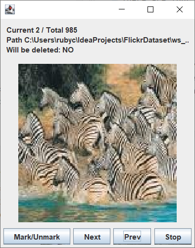

## FlickrDataset

**Simple** program for downloading massive images from flickr.

Archived Siblings:
- Python Implementation: [flickr-dataset](https://github.com/rubycho/flickr-dataset/)
- C++ Implementation: [flickr-dataset-cpp](https://github.com/rubycho/flickr-dataset-cpp/)

This project is intended to be cross-platform
(at least for Windows and Linux).

### Functions

- Download images by keyword from flickr (command: `download`).
- View individual images, mark images to delete (command: `review`).
- Clean-up directory (command: `cleanup`).

### How to use

- Needs JVM.
- Download jar file from release.
- Create an ini file and copy-paste below format,
    edit it to match your purpose.
- Run: `java -jar FlickrDataSet*.jar [command] -c [path to your ini]`

### config.ini format

This format is identical to `config.example.ini`.

```ini
[run]
api_key = [YOUR FLICKR API KEY]
api_secret = [YOUR FLICKR SECRET KEY]
keyword = [KEYWORD]
size = [128 <= IMAGE SIZE <= 640]
sp = [START PAGE]
ep = [END PAGE]
```

### Dev Environment

- Kotlin, Gradle.
- Intellij IDEA recommended.

### Commands

#### `download`

approx. (ep - sp + 1) * 100 images will be downloaded.

#### `review`

The window will show up, and images located on `ws_[keyword]` 
will be shown on the window one by one.

There are four buttons available.



- Mark/Unmark: Mark or Unmark image.
- Next: Show next image.
- Prev: Show previous image.
- Stop: Stop, and remove all marked images.

#### `cleanup`

This command will remove `ws_[keyword]` directory.
